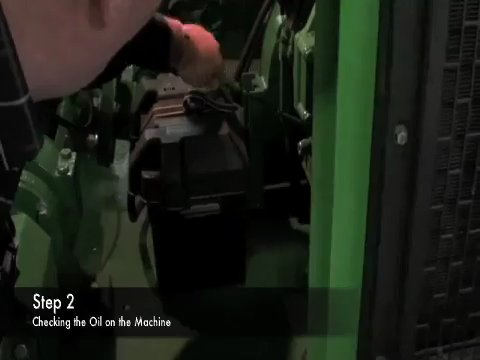
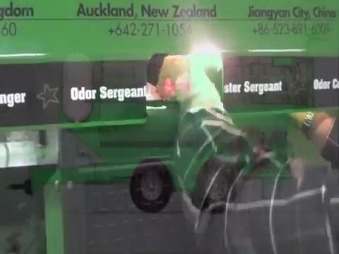

# Visual Check and Periodic Inspection

**Source:** https://www.youtube.com/watch?v=v2OiMIUwzSM

## Overview

Inspect the CAPS 1200 EL for signs of wear, corrosion, leaks, cracks, misalignment, or damage.

## Steps

### Step 1. Step 1: Inspect the valve seat and stem for scoring, corrosion, or uneven wear.

Check the valve seat and stem for signs of scoring, corrosion, or uneven wear. The valve should be clean and free from debris.

*Frame at 0.0s.*

### Step 2. Step 2: Inspect the pump stage for accumulation of contaminants or corrosive substances.

Check the pump stage for accumulation of reddish-orange substance, which could indicate corrosion or buildup of contaminants. The surface should be clean and free from debris.

*Frame at 35.1s.*

### Step 3. Step 3: Inspect the engine for signs of wear, corrosion, or leaks.

Check the engine for signs of rust formation, oil leaks, or excessive wear. The surface should be clean and free from debris.

*Frame at 49.1s.*

### Step 4. Step 4: Inspect the hydraulic filters for proper installation and condition.

Check the hydraulic filters for proper installation, cleanliness, and condition. The filters should be free from debris and damage.

*Frame at 79.2s.*

### Step 5. Step 5: Inspect the valve for proper operation and gauge readings.

Check the valve gauges for proper operation, cleanliness, and condition. The gauges should be accurate and free from debris.

*Frame at 91.3s.*

### Step 6. Step 6: Check the hydraulic fluid level indicator for proper installation and condition.

Check the hydraulic fluid level indicator for proper installation, cleanliness, and condition. The indicator should be accurate and free from debris.

*Frame at 142.4s.*

### Step 7. Step 7: Inspect the machine components for signs of wear, corrosion, or damage.

Check the machine components for signs of rust formation, oxidation, or excessive wear. The surface should be clean and free from debris.

*Frame at 193.6s.*
