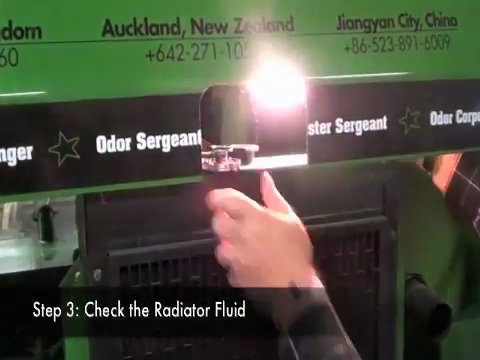
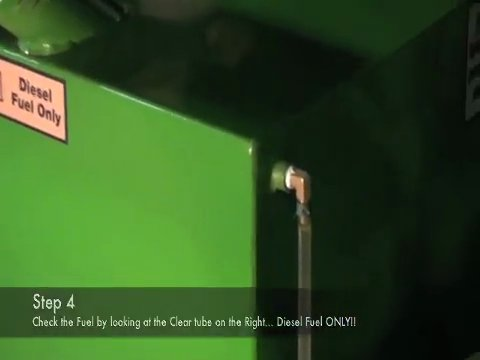
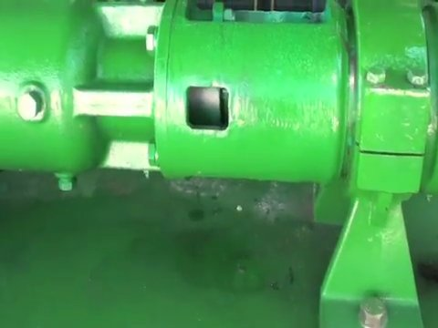
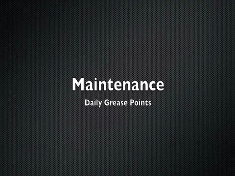
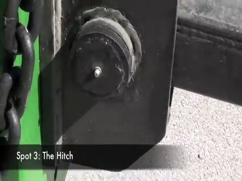

# Visual Check and Periodic Inspection on CAPS 1200 EL

**Source:** https://www.youtube.com/watch?v=v2OiMIUwzSM

## Overview

A step-by-step guide for technicians to perform a visual check and periodic inspection on a CAPS 1200 EL machine.

## Steps

### Step 1. Observe the equipment's overall condition

Look at the entire machine for any visible signs of wear, damage, or maintenance requirements.

*Frame at 0.0s.*

### Step 2. Check the hydraulic fluid level

Verify that the hydraulic fluid level is within the recommended range.

*Frame at 91.3s.*

### Step 3. Inspect the radiator fluid level

Check the condition and level of the radiator fluid.

*Frame at 43.1s.*

### Step 4. Verify fuel type restrictions

Ensure that the correct type of fuel is used, as indicated by labels or instructions on the machine.

*Frame at 58.2s.*

### Step 5. Check the hydraulic fluid dispenser

Verify that the hydraulic fluid dispenser is functioning properly and that there are no leaks.

*Frame at 99.3s.*

### Step 6. Inspect the motor and pulley system

Look for any signs of wear, damage, or maintenance requirements on the motor and pulley system.

*Frame at 142.4s.*

### Step 7. Check the condition of the machine's components

Inspect each component, such as bolts, screws, and other fasteners, for signs of wear or damage.

*Frame at 91.3s.*

### Step 8. Verify that all safety features are functioning properly

Check that all safety features, such as brakes and emergency stops, are in good working condition.

*Frame at 120.3s.*

### Step 9. Take notes on the inspection results

Record any findings or recommendations for maintenance or repairs.

*Frame at 170.5s.*

### Step 10. Clean and organize the work area

Ensure that the work area is clean and organized to prevent accidents or errors.

*Frame at 193.6s.*
