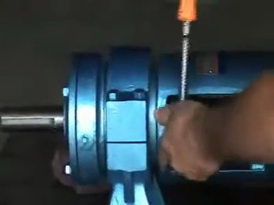
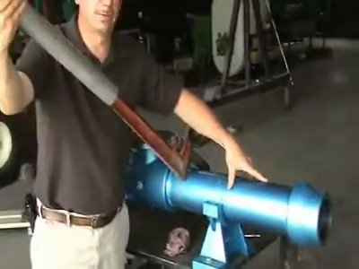
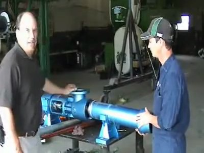

# Disassembly of Progressive Cavity Pump

**Source:** https://www.youtube.com/watch?v=6Y2UDLAOgRI

## Overview

Follow these steps to disassemble a progressive cavity pump.

## Steps

### Step 1. Remove the set plug for the drive pin

Use the 916-pound wrench with a 1 1/2-inch drive socket to remove the set plug from the housing. Verify that the plug is completely removed.

*Frame at 0.0s.*

### Step 2. Remove the hold down plug

Screw out the hold down plug from the other side of the housing and remove it with an alignment tool. Verify that the plug is completely removed.

*Frame at 47.1s.*

### Step 3. Remove the drive pin

Use the 916-pound wrench with a 1 1/2-inch drive socket to remove the drive pin from the connecting rod. Verify that the pin is completely removed.

*Frame at 65.1s.*

### Step 4. Remove the cap screws

Use the 3-8 drive, 3/4-inch socket to remove the cap screws from the housing. Verify that all screws are completely removed.

*Frame at 105.2s.*

### Step 5. Remove the cap

Take off the cap and mark its position on the side of the housing or cap, so it can be put back in place correctly. Verify that the cap is removed.

*Frame at 122.2s.*

### Step 6. Remove the stator and rotor

Use a large pipe wrench to secure it tightly on the stator, then use a leverage bar pipe with the pipe wrench to unscrew the stator and rotor from the housing. Verify that the stator and rotor are completely removed.

*Frame at 105.2s.*

### Step 7. Remove the stator and rotor from the housing assembly

Use a helper to slide the stator and rotor out of the housing assembly and set it on the ground. Verify that the stator and rotor are removed.

*Frame at 195.3s.*

### Step 8. Check the connecting rod washer

Verify that the seal on the end of the connecting rod is in place and the connecting rod washer is not damaged. Verify that the washer is present.

*Frame at 316.5s.*

### Step 9. Check for corrosion

Verify that there is no corrosion on the end of the pin and the main shaft cavity. Verify that there are no signs of water seepage around the collar or plugs.

*Frame at 328.5s.*

### Step 10. Clean and prepare for reassembly

Clean the housing assembly and connecting rod to ensure a proper seal when reassembling. Verify that all components are clean and free of debris.

*Frame at 339.5s.*
