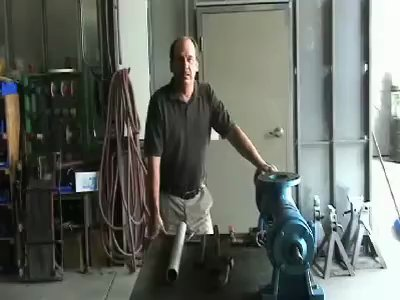
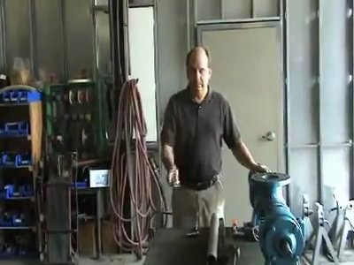
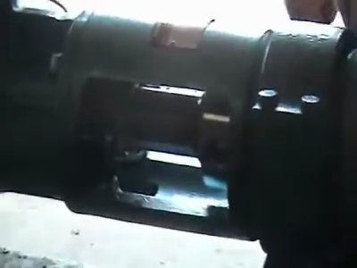
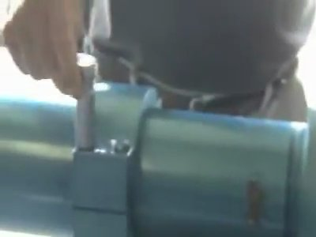
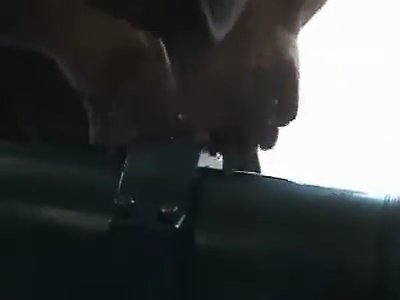
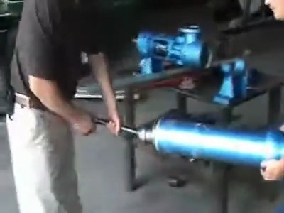
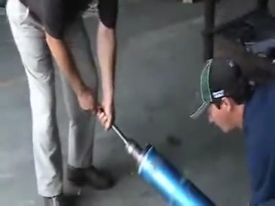
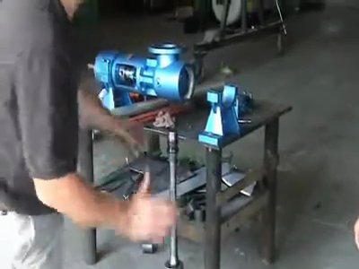

# Disassembly

**Source:** https://www.youtube.com/watch?v=6Y2UDLAOgRI

## Overview

Remove the stator and rotor from the housing to access the drive pin.

## Steps

### Step 1. Locate the drive pin set plug

Identify the set plug for the drive pin, which secures the connecting rod. The plug is located on the bottom of the housing and has a small indentation.

*Frame at 0.0s.*

### Step 2. Remove the hold down plug

Remove the hold down plug from the drive pin using an alignment tool. This will expose the drive pin. Check that the plug is removed completely and not damaged.

*Frame at 47.1s.*

### Step 3. Remove the drive pin

Use a leveraged pipe for the pipe wrench to remove the drive pin from the housing. The pin should be easily removable at this point.

*Frame at 105.2s.*

### Step 4. Remove the cap screws

Remove the four cap screws with a 3-8 drive, three-quarter inch socket. Check that all screws are removed and not damaged.

*Frame at 105.2s.*

### Step 5. Mark the position of the cap

Mark the position of the cap on both sides to ensure it is properly aligned during reassembly. This will prevent cross-threading or misalignment.

*Frame at 122.2s.*

### Step 6. Remove the stator and rotor

Use a large pipe wrench to remove the stator and rotor from the housing assembly. Use a leverage bar pipe to assist with removal, if necessary.

*Frame at 132.2s.*

### Step 7. Set the stator and rotor aside

Slide the stator and rotor out of the housing assembly using a helper. Set them aside on the floor to prevent damage or cross-contamination.

*Frame at 326.5s.*

### Step 8. Inspect the connecting rod washer

Check the seal on the end of the connecting rod for proper installation and condition. The washer should be in good condition and properly seated.

*Frame at 328.5s.*

### Step 9. Verify the connecting rod washer is in place

Ensure the connecting rod washer is properly seated on the end of the connecting rod. If damaged or missing, replace it immediately to prevent corrosion.

*Frame at 328.5s.*

### Step 10. Clean and inspect the housing assembly

Inspect the housing assembly for any signs of damage, wear, or corrosion. Clean the area as needed before reassembly.

*Frame at 339.5s.*
