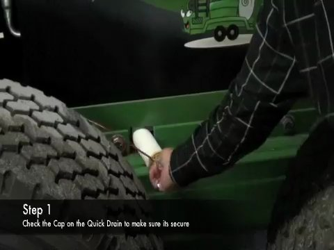
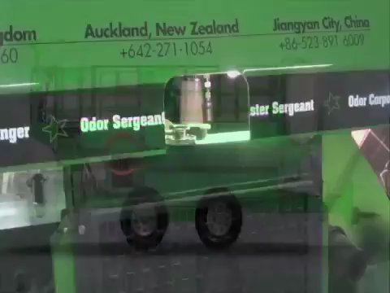
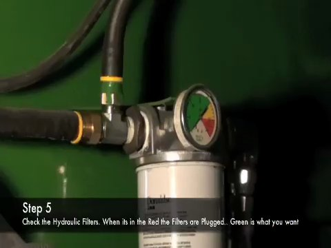
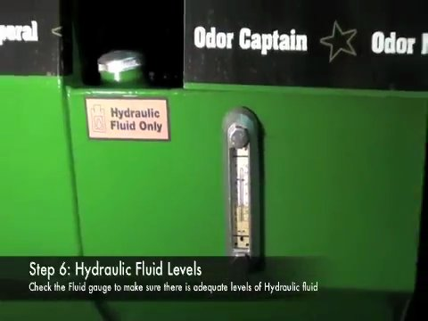
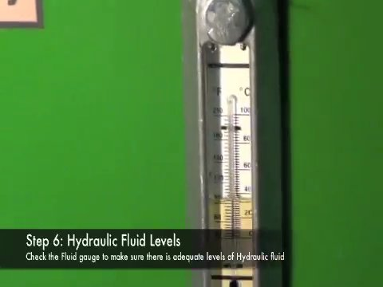
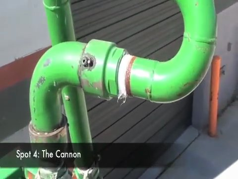
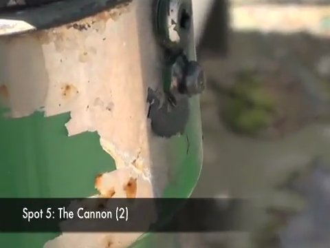

# Visual Check and Periodic Inspection for CAPS 1200 EL

**Source:** https://www.youtube.com/watch?v=v2OiMIUwzSM

## Overview

Perform a thorough visual check and periodic inspection on the CAPS 1200 EL equipment to ensure its proper functioning and condition.

## Steps

### Step 1. Check the cap

Locate the cap on the equipment and verify it is properly attached.

*Frame at 0.0s.*

### Step 2. Examine the green truck

Inspect the green truck component to ensure proper functioning and no signs of damage or wear.

*Frame at 20.1s.*

### Step 3. Check the hydraulic fluid level

Verify the hydraulic fluid level is within the recommended range for safe operation.

*Frame at 42.1s.*

### Step 4. Inspect the hydraulic filters

Check the hydraulic filters for any signs of wear or damage and ensure they are properly installed.

*Frame at 79.2s.*

### Step 5. Perform a visual check on the electrical component

Inspect the electrical component, specifically the gate valve and flush valve, to ensure proper functioning and no signs of damage or wear.

*Frame at 58.2s.*

### Step 6. Check the fluid level for optimal performance and safety

Verify that the hydraulic fluid level is adequate for optimal performance and safety, as indicated by the text overlay.

*Frame at 99.3s.*

### Step 7. Adjust or fix the valve handle

Manipulate the valve handle to allow for pump operation, as indicated by the text overlay.

*Frame at 91.3s.*

### Step 8. Inspect the piping system or electrical conduit

Examine the piping system or electrical conduit closely to ensure it is in good condition and free from signs of damage or wear.

*Frame at 178.5s.*

### Step 9. Assess the integrity of the machine

Evaluate the machine for any irregularities, such as scratches or rust spots, that require attention.

*Frame at 170.5s.*

### Step 10. Adjust or fix a component using a screwdriver

Manipulate the side of the machine to adjust or fix a component, as indicated by the text overlay.

*Frame at 193.6s.*
